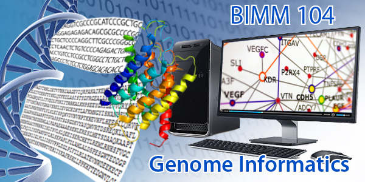

 
This upper division 4-unit [**Genome informatics (BIMM 104)**]() course covers modern developments in genomics with an emphasis on the informatics foundations that facilate the collection, analysis, and interpretation of the avalanche of genomic data in modern life sciences and medical research.  

Major topic areas include: Advances in high-throughput sequencing technologies; Bioinformatic analysis methods and workflows; Genome re-sequencing and variation analysis; Genome wide association studies; Transcriptomics; Comparative genomics; Pharmacogemomics; and Personal genomics.  

Two guest lectures from genomic scientists at Illumina Inc., Synthetic Genomics Inc., Human Longevity Inc., or the La Jolla Institute for Allergy and Immunology will feature subjects chosen by student voting preferences.

 
 
**Course Objectives**:  
At the end of this course students will:

- Understand the process by which genomes are currently sequenced and the bioinformatics processing and analysis required for their interpretation.

- Be familiar with the research objectives of the genomics related sub-disciplines of Transcriptomics, GWAS, Comparative genomics, and Pharmacogenomics.

- Be able to use and evaluate online bioinformatics resources (including major genomic databases, genome browsers and select quality control and analysis tools) to solve problems in genome science.

In short, students will develop a solid foundational knowledge of genome informatics and be able to evaluate new genomic information using online bioinformatic tools and resources. 

 
**Course Overview**:   

 
**Schedule**:  
A detailed lecture schedule with topic outlines is provided [**here**]({{ site.baseurl }}/schedule/).  

- Lectures are on **Tuesday** and **Thursday** at **10:30 - 11:50 am** in [Center Hall, University Center](Map Bldg #984).  

- Discussion groups meet once a week for 50 mins in [Galbraith Hall, Revelle](Map Bldg #141). 

 
**Introductory Screencast**:  (To be updated!)  

 
**Textbook**:  There is no textbook for the course. Lecture notes, homework assignments, grading criteria, pre-class screen casts and required reading material will be available from this website: [https://bioboot.github.io/bimm104_w18/](https://bioboot.github.io/bimm104_w18/) 

 
**Professor**:  
Dr. Barry Grant  
Department of Computational Medicine and Bioinformatics  
2055 Palmer Commons Building  
University of Michigan  

Email: <bjgrant@umich.edu>  
Web: <http://thegrantlab.org>  

**Office hours**: TBD – For now email me for a time and we will make it happen.  

**N.B.**  Please help us improve this course by completing this pre-course [**questionnaire**](http://tinyurl.com/bioinf525-questions). 

